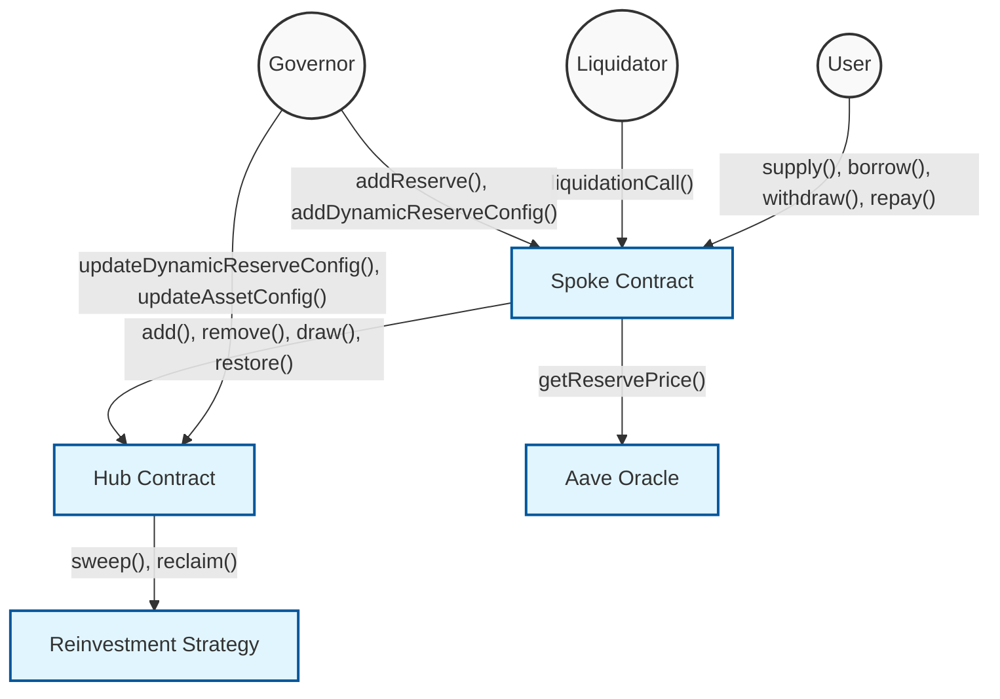
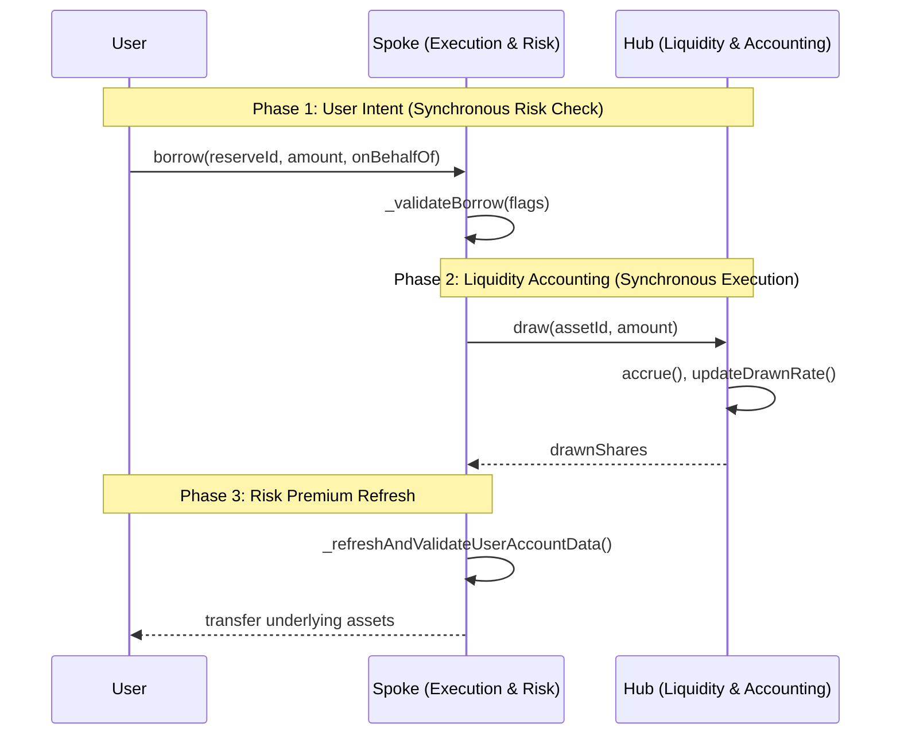

# Protocol Overview

## Core Purpose

Aave V4 is a modular, hub-and-spoke lending protocol that decouples centralized liquidity management from user-facing operations and risk configurations. It introduces dynamic Risk Premiums, charging borrowers variable interest rates based on the quality (Collateral Risk) of their specific collateral, thereby optimizing capital efficiency and rewarding lower-risk positions.

## Visualizations

## Actors & Roles

| Actor                         | Role                                                                                                                                                                     |
| ----------------------------- | ------------------------------------------------------------------------------------------------------------------------------------------------------------------------ |
| **Liquidity Providers** | Supply assets to Spokes to earn base interest from Hub utilization and risk premiums paid by borrowers.                                                                  |
| **Borrowers**           | Deposit assets as collateral and draw debt from the Hub via Spokes, paying a rate based on their Collateral Risk.                                                        |
| **Liquidators**         | Monitor unhealthy positions (HF < 1) and call`liquidationCall` to restore the borrower's HF to the `TargetHealthFactor` in exchange for a dynamic liquidation bonus. |
| **Governor (DAO)**      | Manages dynamic risk configs, authorizes Spokes, configures interest rate strategies, and controls emergency states (paused, frozen, halted).                            |
| **Position Managers**   | Authorized entities (e.g., smart wallets, specific intents) that can execute supply, borrow, withdraw, and repay actions on behalf of a user.                            |

## Contracts

| Contract                               | Purpose                                                                                                                                                                   |
| -------------------------------------- | ------------------------------------------------------------------------------------------------------------------------------------------------------------------------- |
| `Hub`                                | The immutable central liquidity pool. Tracks total added/drawn shares, enforces protocol invariants, and manages global interest rate accrual.                            |
| `Spoke`                              | The upgradeable user-facing router. Handles supply/borrow logic, enforces per-user collateralization limits, calculates dynamic risk premiums, and executes liquidations. |
| `AssetInterestRateStrategy`          | Calculates the base drawn rate for assets in the Hub based on utilization.                                                                                                |
| `LiquidationLogic`                   | Library holding the core logic for the Dutch-auction style liquidation and dynamic dust handling.                                                                         |
| `PositionManagerBase` (and variants) | Peripheral contracts that allow delegating position management to authorized intent-based takers or configurations.                                                       |

## Terminology

- **Hub**: The centralized contract where all idle liquidity resides. It knows nothing about user risk, only total Spoke limits.
- **Spoke**: The module where user positions live. Different Spokes can have different assets, rules, or user segments.
- **Collateral Risk**: A parameter (0-1000_00 BPS) assigned to each asset representing its volatility/risk. Lower is better.
- **User Risk Premium**: The weighted average of Collateral Risks from a user's active collateral, resulting in additional premium interest on their debt.
- **Drawn Debt vs Premium Debt**: Debt is split internally into base utilization debt (drawn) and risk-based debt (premium shares).
- **Target Health Factor**: Unlike V3's fixed close factor, V4 liquidations repay only enough debt to restore the user's HF to this target value.
- **Dynamic Config Key**: A versioning system for collateral parameters, allowing parameter updates for new positions without forcing older positions into immediate liquidation.

## Key Invariants

- "Total borrowed shares == sum of Spoke debt shares"
- "Hub added assets amount >= sum of Spoke added assets amount"
- "Hub added shares == sum of Spoke added shares"
- "Supply share price and drawn index cannot decrease"
- "User positions cannot be pushed below `HEALTH_FACTOR_LIQUIDATION_THRESHOLD` via user actions (borrow, withdraw, setUsingAsCollateral)"
- "Total user premium debt must remain constant immediately before and after `refreshPremium` recalibrations"

## Main Assets

- `Underlying Assets` (ERC20s) — The actual tokens supplied and borrowed.
- `Added Shares` — Internal accounting representing a Spoke's share of the Hub's total supplied liquidity.
- `Drawn Shares` — Internal accounting representing a Spoke's share of the Hub's total borrowed liquidity.
- `Premium Shares` — Virtual debt shares used to track the additional interest owed by borrowers due to their Risk Premium.

## Happy Paths

Path 1 — Supply Liquidity
1.1. User → `Spoke.supply()`: User deposits underlying ERC20 to the Spoke.
1.2. Spoke → `Hub.add()`: Spoke routes tokens to Hub; Hub mints Added Shares to Spoke's balance.

Path 2 — Borrow Asset
2.1. User → `Spoke.borrow()`: Spoke requests Hub to mint Drawn Shares and transfer underlying to User.
2.2. Spoke → `Spoke._refreshAndValidateUserAccountData()`: Re-evaluates user's Health Factor and updates their User Risk Premium.

Path 3 — Standard Liquidation
3.1. Liquidator → `Spoke.liquidationCall()`: Liquidator repays a portion of the user's debt.
3.2. Spoke → `Hub.restore()`: Spoke repays the Hub, reduces user's Drawn Shares, seizes corresponding collateral (with bonus), and transfers to Liquidator.

Path 4 — Deficit Elimination
4.1. Liquidator → `Spoke.liquidationCall()`: Liquidates the last collateral but user still owes debt; Spoke records a deficit.
4.2. Governor/Spoke → `Hub.eliminateDeficit()`: Another well-capitalized Spoke uses its Added Shares to cover the bad debt in the Hub.

## External Dependencies

| Dependency                         | Type       | Critical Assumption                                                                                                                                                  |
| ---------------------------------- | ---------- | -------------------------------------------------------------------------------------------------------------------------------------------------------------------- |
| **AaveOracle**               | Price Feed | Asset prices are accurate, timely, and correctly scaled (8 decimals by default). Stale prices could cause unwarranted liquidations or undercollateralized borrowing. |
| **ERC20 Tokens**             | Asset      | Standard behavior (no weird callbacks during transfer). The system assumes transfers to/from Hub succeed if return values pass`SafeERC20`.                         |
| **Reinvestment Controllers** | Strategy   | If utilized, the Hub trusts the controller to safely sweep and reclaim idle liquidity. Strategy failure results in loss absorbed by the Governor.                    |
